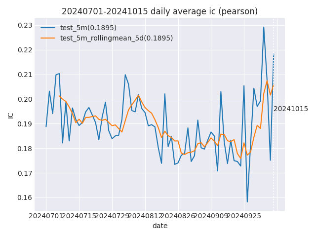
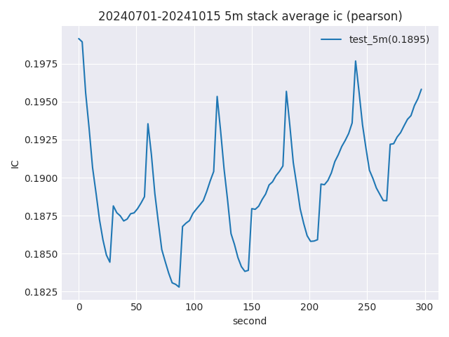

# IC Calculator

* 使用run_cs_ic_calculator.py 模块生成指定截面因子的IC值，结果会保存在`{output}/cs_ic.{信号名称}.{开始日期}.{结束日期}.{future_bias}`文件夹中，且文件名为`{信号名称}.csv`

```bash
python3 run_cs_ic_calculator.py {任意一天的金刚狼信号配置文件} -o {输出目录} --start {start_date} --end {end_date} --future-bias 30s,5m

# 其中future-bias是想要计算的future return，可以提供多个逗号分隔的值。具体可以参考-h/--help命令

```

* 结果会保存在`{output}/cs_ic.{信号名称}.{开始日期}.{结束日期}.{future_bias}`文件夹中，且文件名为`{信号名称}.csv`

# 计算T0相关信息

这一步依赖于IC calculator结果，会生成以下几张图片，包括
* ic_avg_daily - 日均ic曲线及5d平均曲线



* ic_stack_avg_1m/5m/daily: 将交易时段切割成相等大小（1min或者5min或者全天）的区间并堆叠，计算区间内的ic平均值



* corr_avg_daily: 因子daily corr（如果因子数量大于1）

* corr_stack_avg_intraday: 因子日内corr（如果因子数量大于1）

使用方式
```bash
python3 run_t0_stats.py -ic output/cs_ic.csstock-py.20230701.20230709.5m [-ic {第二个因子的dump值} ] -o output/ -s 20230701 -e 20230709

```

程序会自动从文件夹名称中提取信息并检查IC数据，无误后将3张或者5张统计数据图片保存在指定的输出文件夹中。

如果统计天数较多，可以在`plt.figure()`函数内指定图片大小，以使图片更加直观。

