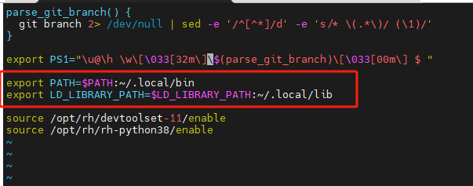
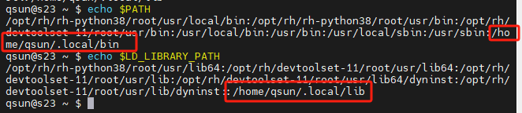
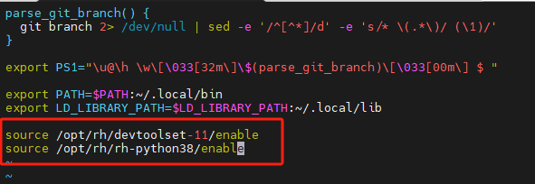
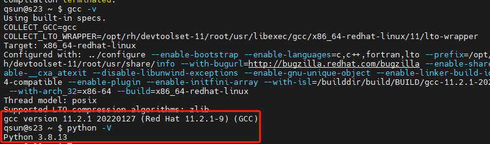
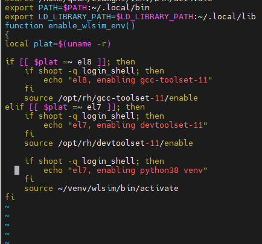

# 快速开始
- [快速开始](#快速开始)
  - [搭建系统环境](#搭建系统环境)
  - [搭建wlsim回测系统](#搭建wlsim回测系统)
  - [文档和数据说明](#文档和数据说明)
  
## 搭建系统环境
<mark>不要使用conda环境！</mark>  
<mark>不要使用conda环境！！</mark>  
<mark>不要使用conda环境！！！</mark>  
- 添加环境变量  
    - 向 `~/.bashrc`文件中插入以下两行：
        ```
        export PATH=$PATH:~/.local/bin
        export LD_LIBRARY_PATH=$LD_LIBRARY_PATH:~/.local/lib
        ``` 
        
    - 执行 `source ~/.bashrc` 使其生效
    - 验证是否添加成功
        ```
        echo $PATH
        echo $LD_LIBRARY_PATH
        ```
        

- 设置编译环境
    - 查看Python和gcc版本
        ```
        gcc -v
        python3 -V # 或者执行 python3.8 -v
        ```
        gcc的版本需要是11，Python的版本需要为3.8，如果系统中gcc和Python版本不满足要求，需要升级版本
    - 设置系统python和gcc版本
        向 `~/.bashrc`文件中插入以下两行：
        ```
        source /opt/rh/devtoolset-11/enable
        source /opt/rh/rh-python38/enable
        ```
        
    - 执行 `source ~/.bashrc` 使其生效
    - 验证是否设置成功  
        

- 如果wlsim的编译环境和系统中已有框架冲突，可以使用以下方法避免冲突：
    - 临时性地激活devtoolset-11和rh-python38  
        ```
        source /opt/rh/devtoolset-11/enable
        source /opt/rh/rh-python38/enable
        ```
    - 为项目创建python虚拟环境
        ```
        python3 -m venv ~/venv/wlsim
        ```
    - 在 ~/.bashrc 中插入;
        ```
        export PATH=$PATH:~/.local/bin
        export LD_LIBRARY_PATH=$LD_LIBRARY_PATH:~/.local/lib
        function enable_wlsim_env()
        {
        local plat=$(uname -r)

        if [[ $plat =~ el8 ]]; then
            if shopt -q login_shell; then
                echo "el8, enabling gcc-toolset-11"
            fi
            source /opt/rh/gcc-toolset-11/enable
        elif [[ $plat =~ el7 ]]; then
            if shopt -q login_shell; then
                echo "el7, enabling devtoolset-11"
            fi
            source /opt/rh/devtoolset-11/enable

            if shopt -q login_shell; then
                echo "el7, enabling rh-python38"
            fi
            source /opt/rh/rh-python38/enable

            if shopt -q login_shell; then
                echo "el7, enabling wlsim python38 venv
            fi
            source ~/venv/wlsim/bin/activate
        fi
        }
        ```
        
    - 执行 `source ~/.bashrc` 使其生效, 每次使用 wlsim 之前执行 `enable_wlsim_env` 来激活编译环境

- 安装必要的python包：      
        `python3.8 -m pip install --user Cython wheel "numpy>=1.23.4" -i https://pypi.tuna.tsinghua.edu.cn/simple`
    

## 搭建wlsim回测系统
- 安装wlsim回测框架
    - 安装包保存在
      - `/mnt/nas-3/homes/nickchenyj/wlsim/packages`
      - `/mnt/nas-i/homes/nickchenyj/wlsim/packages`
      - 如无访问权限，请联系维护人员
    - 执行 `python3 install_runtime.py`来安装回测系统
    - 将本项目clone到本地
        - `git clone http://192.168.1.101:18086/nickchenyj/wolverine-demo.git`
        - <mark>**实习生**请使用 `intern` 分支</mark>：`git clone http://192.168.1.101:18086/nickchenyj/wolverine-demo.git -b intern`
    - 构建本项目
        在`wolverine-demo`项目的根路径下执行以下语句：
        ```
        # 构建debug版本
        mkdir -p build/Debug
        pushd build/Debug
        cmake -DCMAKE_BUILD_TYPE=Debug ../../
        # or Release build
        # mkdir -p build/Release
        # pushd build/Release
        # cmake -DCMAKE_BUILD_TYPE=Release ../../

        make -j8 install
        popd
        ```
    - 测试用例  
        在`wolverine-demo`项目的根路径下执行：`wl-sim src/csstock/wlsim.yml
`
- **注意**，在wlsim的后续使用过程中：
    - wlsim回测框架更新时(即`/mnt/nas-3/homes/nickchenyj/wlsim/packages`路径下的文件更新时)，需要执行`python3 install_runtime.py`来更新回测系统
    - 使新的因子实现生效，比如`wolverine-demo/src/xxxxxx/`中的`CMakeLists.txt`，`*.cpp`，`*.py`，`*.pyx`有改动，或者`git pull`之后，需要执行
        ```
        # 构建debug版本
        mkdir -p build/Debug
        pushd build/Debug
        cmake -DCMAKE_BUILD_TYPE=Debug ../../
        # or Release build
        # mkdir -p build/Release
        # pushd build/Release
        # cmake -DCMAKE_BUILD_TYPE=Release ../../

        make -j8 install
        popd
        ```

## 文档和数据说明
- [wlsim tutorial](tutorial.md)
