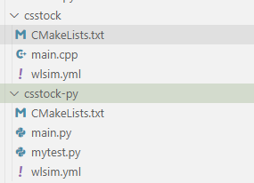

# wlsim tutorial
- [wlsim tutorial](#wlsim-tutorial)
  - [安装和使用](#安装和使用)
  - [Demo �C 因子项目构成](#demo--因子项目构成)
    - [CMakeLists.txt](#cmakeliststxt)
    - [wlsim.yml](#wlsimyml)
      - [marketdata 详细说明](#marketdata-详细说明)
        - [bar数据](#bar数据)
        - [cs-snapshot数据](#cs-snapshot数据)
        - [cs-mbo 数据](#cs-mbo-数据)
        - [snapshot数据](#snapshot数据)
    - [mian.py/main.pyx/main.cpp -- 因子实现](#mianpymainpyxmaincpp----因子实现)
  - [数据说明](#数据说明)
    - [时间戳](#时间戳)
  - [wlsim更新日志](#wlsim更新日志)


## 安装和使用 
- [English version](quick_start.md)
- [中文版](quick_start_CN.md)  

## Demo �C 因子项目构成
每个目录包含几个基本文件:
- CMakeLists.txt: build tool，用于编译因子文件
- wlsim.yml: 配置文件
- main.cpp/main.py: c++/python 实现  


### CMakeLists.txt
[CMake](https://cmake.org/)是常用的跨平台自动构建系统，用来编译、打包代码。  
wlsim将基本功能做了封装，用户只需要调用单一Cmake函数add_wolverine_library()即可
使用wlsim回测新的因子实现。  
add_wolverine_library函数包含四个字段：
- NAME：因子名称 
- USER：用户名 （在因子库中，USER+NAME为唯一标识） 
- SRCS：因子计算包含的所有源文件，必须在命名为main的源文件中定义信号实现的方法。
- TYPE：signal(C++) 或 pysig（python） 

### wlsim.yml 
使用[YAML](https://yaml.org/)格式的配置文件订阅行情数据、指定交易目标和信号信息等。
以 src/csstock/wlsim.yml 为例：
```
calendar: scripts/ChinaTradingDates.txt
start: 20230103
end: 20230104

refdata:
  config:
    # data_dir: /global/wlsim/data/refdata

signal:
  name: csstock
  module: nickchenyj.csstock
  output:
    module: csv
    config:
      output_dir: output
  config:
    targets:
      - dynamic:stocks
    marketdata:
      - module: cs-snapshot
        symbols:
          - stocks
        config:
          # data_dir: /global/wlsim/data/cs_snapshot
          fields:
            - last_price
            - volume
            - ap
          levels: 1
    # freq can be 60/120/180
    freq: 120
```
- calendar：定义交易日历(使用默认值即可)
- start/end：回测日期段
- refdata：合约、股票的基本信息(使用默认值即可)
- signal：因子模块，包括
    - name：因子名称（保存因子值时的文件名称）
    - module：模块名称，需要设置为CMakeLists.txt中的`USER.NAME`
    - output：用于保存因子值
        - module：因子文件格式，可以选择npy或者csv
        - output_dir： 因子保存路径，最终因子值会保存为`{output_dir}/{name}.{module}`
    - config：因子相关的配置
        - targets：列表格式的交易品种，支持合约名称(格式为`期货品种.交易所名称`)以及`dynamic:stocks`(对应内置的每日4000+票的股票池) 
        - marketdata：行情配置，包含一个或多个行情模块。
            -  module：模块名称/行情类型
            -  symbols：列表格式的订阅品种，即接收哪些品种的行情数据
            -  config：行情数据配置，可配置字段见 [marketdata 详细说明](#marketdata-详细说明)
        - 再往下为因子自定义部分，因子可以将自定义参数写在下方，并在因子初始化接口中读取参数配置。 
---
#### marketdata 详细说明
##### bar数据
- 期货bar数据
  ```
  marketdata:
  - module: bar
    symbols:
      - IC.CFFEX
    config:
      # data_dir: /global/wlsim/data/snapshot_bin
      freq: 5
  ```
- 配置说明：
  - symbols： 目前只支持期货，格式为`期货品种.交易所名称`
  - data_dir：原始行情数据保存路径，默认为 `/mnt/nas-3/ProcessedData/snapshot_bin`
  - freq：bar的长度，单位为分钟
  - ignore_missing：是否跳过缺失数据。bar数据由期货快照数据处理生成，存在部分缺失。如果设置为`true`，则程序运行过程中跳过缺失日期数据；否则如遇缺失，程序报错中断。默认设置为`false`。
- 字段说明：  
  marketdata中订阅了bar数据之后，用户可以在 mian.py/main.pyx/main.cpp 中定义 `on_bar`函数获取bar数据。 (eg: `def on_bar(self, ev: BarEvent)`, 示例请见`src/bar-py/main.py`)   
  `BarEvent`的结构为：（见`~/.local/include/wolverine/event.hpp`）
  ```
  struct BarEvent {
    const MdStatic *ms;
    const MdBar *bar;
  };
  ```
  包含 ms 和 bar 两个指针，分别指向类型为 MdStatic 和 MdBar的两个对象。
  `MdStatic`和 `MdBar`的结构为:（见`~/.local/include/wolverine/marketdata.hpp`）
  ```
  struct MdStatic {
    char instrument[16]; //合约代码
    char ticker[16]; //品种代码     
    char exchange[8]; //交易市场代码

    double tick_size; //最小价格变动单位
    double limitup; //涨停价
    double limitdown; //跌停价

    int multiplier; //合约乘数
    int session_nr; //交易时间段个数
    struct session { 
      int64_t begin; 
      int64_t end;
    } session[4]; //交易时间段信息，单位为ns，逻辑和exchtime相同，夜盘(18:00以后)为负值
  };

  struct MdBar {
    int64_t exchtime; 
    uint64_t localtime;

    double open; //bar开始的价格
    double high; //最高价
    double low; //最低价
    double close; //bar结束的价格

    uint64_t volume; //成交量
    double turnover; //成交额

    double twap_bid; //时间加权平均买入价格
    double twap_ask; //时间加权平均卖出价格
  };
  ```
##### cs-snapshot数据
- 股票截面3s快照数据      
  ```
  marketdata:
  - module: cs-snapshot
    symbols:
      - stocks
    config:
      # data_dir: /data/
      fields:
        - last_price
        - volume
        - ap
      levels: 5
  ``` 
- 配置说明：
  - symbols： 目前只支持全量股票池，即`stocks`
  - data_dir：原始行情数据保存路径，默认为 `/mnt/nas-3/ProcessedData/stock_snapshot_bin/binary_tick`
  - fields: 订阅字段
  - levels：买卖盘口信息档数，返回前`levels`档数据
- 字段说明：  
  marketdata中订阅了cs-snapshot数据之后，用户可以在 mian.py/main.pyx/main.cpp 中定义 `on_cs_snapshot`函数获取cs-snapshot数据。 (eg: `def on_cs_snapshot(self, ev: CsSnapshotEvent):`, 示例请见`src/csstock-py/main.py`和`src/csstock/main.cpp`)   
  `CsSnapshotEvent`的结构为：（见`~/.local/include/wolverine/event.hpp`）
  ```
  struct CsSnapshotEvent {
    // FldType声明了cs-snapshot数据可以订阅的所有字段
    // 并用注释的形式说明了每种字段对应的类型
    enum class FldType : uint8_t {
      // int64_t
      exchtime = 0,
      // uint64_t
      localtime = 1,

      // double
      last_price = 2,
      // uint64_t
      volume = 3,
      // double
      turnover = 4,
      // int64_t
      open_interest = 5,

      // the following are level-based
      // double [level][ins]
      bp = 6,
      // uint32_t [level][ins]
      bv = 7,
      // double [level][ins]
      ap = 8,
      // uint32_t [level][ins]
      av = 9,

      // uint32_t [level][ins]
      bid_cnt = 10,
      // uint32_t [level][ins]
      ask_cnt = 11,

      // aggregate
      // uint64_t
      total_bid_qty = 12,
      // uint64_t
      total_ask_qty = 13,
      // uint64_t
      total_bid_cnt = 14,
      // uint64_t
      total_ask_cnt = 15,
      // uint32_t
      total_bid_lvl = 16,
      // uint32_t
      total_ask_lvl = 17,

      _MAX = 18,
    };

    // FldDataPtr以统一的形式定义了所有字段数据的存储结构
    // 比如 last_price、turnover 会保存为一个double型的数组，即const double *double_ptr;
    // bv、av会保存为一个二维的uint32_t型数组，即const uint32_t *const *uint32_ptrs;
    union FldDataPtr {
      const int32_t *int32_ptr;
      const int32_t *const *int32_ptrs;
      const uint32_t *uint32_ptr;
      const uint32_t *const *uint32_ptrs;
      const int64_t *int64_ptr;
      const int64_t *const *int64_ptrs;
      const uint64_t *uint64_ptr;
      const uint64_t *const *uint64_ptrs;
      const double *double_ptr;
      const double *const *double_ptrs;
      const void *void_ptr;
      const void *const *void_ptrs;
    };

    int64_t exchtime;
    uint64_t localtime;
    uint16_t ins_nr;   // 合约数量
    uint8_t level_nr;  // 行情档数
    FldDataPtr flds[static_cast<int>(FldType::_MAX)]; //具体的行情数据
  };
  ```
- 使用说明：
  1. 首先在配置文件 wlsim.yml 中定义 需要订阅的字段类型`fields`和行情档数`levels`。`fields`的支持类型见FldType中的声明（时间戳 exchtime和 localtime无须声明），部分FldType只在 股票/期货 数据中有效。`levels`的支持范围为[0,10].
  2. 可以在`on_sod`中获取当天的合约列表，在当天中所有字段的数据会以该顺序返回。
      ```
      def on_sod(self, ev: SodEvent):
        targets = []
        print(f"on_sod:{ev.date},ins_nr:{ev.ins_nr}")
        for i in range(ev.ins_nr):
            ms: MdStatic = ev.ms[i].contents
            targets.append(
                ms.instrument.decode("utf8") + "." +
                ms.exchange.decode("utf8"))
      ```
  3. 在`on_cs_snapshot`中从`ev.data[i]`（python）/`ev->flds[i]`（C++）中获取字段数据。`i`指`fields`中字段在`FldType`中对应的枚举常量。
      ```
      def on_cs_snapshot(self, ev: CsSnapshotEvent):
          // last_price_data是一个类型为double的ndarray，长度为ins_nr
          last_price_data = ev.data[CsSnapshotEvent.FldType.LAST_PRICE.value]
          // ap_data是一个类型为ndarray的列表，长度为level_nr（即levels）
          // ap_data的每一个元素都是一个类型为double的ndarray，并且长度为ins_nr
          // ap_data[i] 表示 所有合约的 卖i+1价数据
          ap_data = ev.data[CsSnapshotEvent.FldType.AP.value]
      ```
##### cs-mbo 数据
- 股票MBO（Market By Order）数据 
  ```
  - module: cs-mbo
    symbols:
      - stocks
    config:
      data_dir: /mnt/nas-3/ProcessedData/tick_slice_3s_bin
  ```
- 配置说明：
   - symbols： 目前只支持全量股票池，即`stocks`
   - data_dir：原始行情数据保存路径，默认为 `/mnt/nas-3/ProcessedData/tick_slice_3s_bin`
- 字段说明：  
 marketdata中订阅了cs-mbo 数据之后，用户可以在 mian.py/main.pyx/main.cpp 中定义 `on_cs_mbo`函数获取cs_mbo数据。 (eg: `def on_cs_mbo(self, ev: CsMboEvent):`, 示例请见`src/csmbo-py/main.py`和`src/csmbo/main.cpp`)   
 `CsMboEvent`的结构为：（见`~/.local/include/wolverine/event.hpp`）
  ```
  struct CsMboEvent {
  enum class MsgType : uint8_t {
    Order = 0,
    Cancel = 1,
    Trade = 2,
  };

  enum class OrderFldType : uint8_t {
    Exchtime = 0,
    Localtime = 1,
    Price = 2,
    Qty = 3,
    Side = 4,
    OrderId = 5,
  };

  enum class CancelFldType : uint8_t {
    Exchtime = 0,
    Localtime = 1,
    Price = 2,
    Qty = 3,
    Side = 4,
    OrderId = 5,
  };

  enum class TradeFldType : uint8_t {
    Exchtime = 0,
    Localtime = 1,
    Price = 2,
    Qty = 3,
    Side = 4,
    BidId = 5,
    AskId = 6,
  };

  struct Order {
    const uint32_t *cnt; //委托单数
    const int64_t *const *exchtime; // 交易所收到订单时的时间戳；从当天零时开始的纳秒数
    const uint64_t *const *localtime; // 本地时间戳，录行情的机器收到订单的时间戳；ns 精度的epoch time
    const double *const *price; // 当订单是市价单、最优单时为0，非零值表示限价单的价格
    const uint32_t *const *qty; // 委托股数。
                                // 深交所：原始的委托量；
                                // 上交所：去掉立即成交部分的剩余委托量，若订单全部立即成交没有order
    const Side *const *side; // 委托订单的买卖方向，0――买，1――卖
    const uint64_t *const *orderid; // 委托订单的订单号
  };

  struct Cancel {
    const uint32_t *cnt; 
    const int64_t *const *exchtime; 
    const uint64_t *const *localtime;
    const double *const *price; // 当订单是市价单、最优单时为0，非零值表示限价单的价格
    const uint32_t *const *qty; //对于深交所，是发单的委托量；对于上交所，是扣除立即成交的剩余委托量
    const Side *const *side; //委托订单的买卖方向，0――买，1――卖
    const uint64_t *const *orderid; // 撤销订单的订单号
  };

  struct Trade {
    const uint32_t *cnt; 
    const int64_t *const *exchtime;
    const uint64_t *const *localtime;
    const double *const *price; // 成交价
    const uint32_t *const *qty; // 成交股数
    const Side *const *side; // 触发成交的订单类型，askid > bidid
    const uint64_t *const *bidid; // 撤销订单的bid订单号
    const uint64_t *const *askid; // 撤销订单的ask订单号
  };

  int64_t exchtime;
  uint64_t localtime;
  uint16_t ins_nr;  //合约数量
  const Order *orders; //委托订单
  const Cancel *cancels; //取消订单
  const Trade *trades; //成交订单
  };
  ```
##### snapshot数据
- 期货单个合约快照数据
  ```
  marketdata:
    - module: snapshot
      symbols:
        - IC.CFFEX
        - IF.CFFEX
        - IH.CFFEX
        - a.DCE
        - b.DCE
        - c.DCE
        - cs.DCE
        - eb.DCE
        - eg.DCE
      config: {}
  ```  
- 配置说明：
  - symbols： 只支持期货，格式为`期货品种.交易所名称`
  - data_dir：原始行情数据保存路径，默认为 `/mnt/nas-3/ProcessedData/snapshot_bin`
  - ignore_missing：是否跳过缺失数据。期货快照数据存在部分缺失，如果设置为`true`则程序运行过程中跳过缺失日期数据；否则如遇缺失，程序报错中断。默认设置为`false`。
- 字段说明：  
 marketdata中订阅了snapshot数据之后，用户可以在 mian.py/main.pyx/main.cpp 中定义 `on_snapshot`函数获取snapshot数据。 (eg: `def on_snapshot(self, ev: SnapshotEvent):`, 示例请见`src/snapshot-py/main.py`, `src/snapshot/main.cpp`), `src/multitickers-py/main.py`和`src/multitickers/main.cpp`。
 `SnapshotEvent`的结构为：（见`~/.local/include/wolverine/event.hpp`）
  ```
  struct SnapshotEvent {
  const MdStatic *ms;
  const MdSnapshot *snapshot;
  };
  ```
  包含 ms 和 snapshot 两个指针，分别指向类型为 MdStatic 和 MdSnapshot 的两个对象。
  `MdStatic`和 `MdSnapshot`的结构为:（见`~/.local/include/wolverine/marketdata.hpp`）
  ```
  struct MdStatic {
    char instrument[16]; //合约代码
    char ticker[16]; //品种代码     
    char exchange[8]; //交易市场代码

    double tick_size; //最小价格变动单位
    double limitup; //涨停价
    double limitdown; //跌停价

    int multiplier; //合约乘数
    int session_nr; //交易时间段个数
    struct session { 
      int64_t begin; 
      int64_t end;
    } session[4]; //交易时间段信息，单位为ns，逻辑和exchtime相同，夜盘(18:00以后)为负值
  };

  // 买卖盘口信息
  struct MdLevel {
    double ap; //卖出价
    double bp; //买入价
    int32_t av; //卖出量
    int32_t bv; //买入量
  };

  struct MdSnapshot {
    enum class SnapshotType : uint8_t {
      Level1 = 0,  //只返回1档行情
      Level5 = 1,  //返回5档行情
    };

    SnapshotType type; //类型
    int64_t exchtime; 
    uint64_t localtime; 

    double last_price; //最后一个成交价
    uint64_t total_volume; //成交量
    double total_turnover; //成交额
    int64_t open_interest; //未平仓量

    //constexpr size_t MD_SNAPSHOT_MAX_LEVEL_NR = 10;
    MdLevel levels[MD_SNAPSHOT_MAX_LEVEL_NR]; //行情数据
  };
  ```
- 数据说明  
特殊情况有如下几种:  
1、全天停牌，但交易所有推数据，数据无任何信息量  
   --> 当天未产生任何有价值的交易数据，在当天的3s快照中不生成  
2、自开盘开始临时停牌，在当天之后的时间又开始交易的  
   --> ap1，bp1填nan（挂单量填0）；last填nan  
3、股票不活跃，当天开始的某一段时间没产生成交价  
   --> last填法跟2保持一致  
4、股票涨跌停  
   --> 一档挂单价为0的那一侧填对手价，挂单量为0  

### mian.py/main.pyx/main.cpp -- 因子实现
- 实现事件接口
    - on_sod: start of day时被触发，可以获取一天开始行情的静态数据
    - on_eod: end of day
    - on_snapshot/on_bar/on_cs_snapshot/on_cs_mbo：获取订阅品种的行情数据
- 通过系统接口`void (*update_signal)(void *token, int64_t exchtime, uint64_t localtime, uint16_t ins_nr, const double *sigs);`(C++)或者`update_signal(self, exchtime: int, localtime: int, sigs: np.ndarray)`(python) 更新因子值
- 事件接口和事件的定义可以在以下文件查看
    - C++：`~/.local/include/wolverine/`
    - python: `~/.local/lib/python3.8/site-packages/cfi/wolverine/`


## 数据说明
### 时间戳
包含两种纳秒精度的时间戳：
- exchtime：数据类型为int64_t，含义为距离一天（00：:00：:00）开始的纳秒数。记` NS_PER_HOUR = 3600 * int(1e9)`，即一小时内的纳秒数量，则 
    - 9:00:00 对应的 exchtime 为 `9 * NS_PER_HOUR`
    - 21:30:00 对应的 exchtime 为 `-2.5 * NS_PER_HOUR`, 即 18:00:00 以后的时间对应的exchtime为负值。

    `hh:mm:ss.f`格式的时间和exchtime转换关系为：

    ```
    def hhmmssf_to_exchtime(val: str) -> in
        hh: int = int(val[:2])
        mm: int = int(val[3:5])
        ss: int = int(val[6:8])
        ff: int = int(val[9:])
        time: int = hh * 3600 * int(1e9) + mm * 60 * int(1e9) + ss * int(1e9) + ff
        if hh >= 18:
            time -= 24 * 3600 * int(1e9)
        return time
    ```

- localtime(uint64_t): Epoch Time。  
    localtime 和 datetime的转换关系为：
    - 保留纳秒精度
        `pd.to_datetime(df["localtime"], utc=True).apply(lambda x: x.tz_convert("Asia/Shanghai").tz_localize(None))`
    - 不保留纳秒精度
        ```
        pd.Timestamp.fromtimestamp(x/1e9)
        datetime.datetime.fromtimestamp(x/1e9)   
        ```
        
## wlsim更新日志
[changelog](../changelog.md)